# Sheraz Arshad - Tech Stack

**Full Stack Web Developer · Vue • Nuxt • TypeScript**
6+ years building scalable, production-ready web applications end to end - responsive frontends, secure APIs, databases, and containerized deployments.

I own the full lifecycle: UI, server routes, database schema and migrations, auth, payments, email, and Docker-based deployment.

## 1. Preferred Stack - My Daily Driver

**This is the stack I work in every day on [Centralyn](https://github.com/SherazJutt/centralyn)**, my flagship multi-tenant SaaS platform (white-label client portal, live in production with Docker + Caddy). It is the stack I am most fluent and current in.

### Frontend

- **Nuxt 4** - SSR apps, server routes (Nitro), and a pnpm monorepo of three apps (marketing site, dashboard, admin console)
- **Vue 3** - Composition API, `<script setup>`, reusable component architecture
- **TypeScript** - strict typing across the whole codebase, end to end
- **Tailwind CSS v4** - utility-first styling, the styling foundation for every app
- **Nuxt UI 4** - component library, theming, dark mode, fully responsive UI
- **VueUse** - composables and browser utilities
- **@vueuse/motion** - declarative motion and animations for Vue
- **Tiptap** - rich-text editor (markdown, task lists, images, mentions)

### Backend & Data

- **Nitro** - Nuxt server engine, API routes, server middleware
- **PostgreSQL 16** - relational data modeling for multi-tenant architecture
- **Drizzle ORM + Drizzle Kit** - typed schema, queries, and versioned migrations
- **Zod** - runtime validation for inputs and API contracts
- **Node.js** - server-side logic and CLI tooling

### Auth, Payments & Integrations

- **better-auth** - self-hosted auth: email + password, email OTP, Google OAuth, session management, account linking
- **Polar** - subscription and wallet payments / billing
- **AWS SES** - transactional email delivery
- **Satori + resvg** - dynamic Open Graph image generation

### Infrastructure, Docker & Deployment

- **Docker** - fully custom container setup: multi-stage Dockerfiles per service, resource limits, healthchecks, and log rotation
- **CLI-based deploy system (self-hosted, PaaS-like)** - I built an interactive deploy CLI (`scripts/deploy.mjs`) that lists running containers and images, builds dynamically tagged images, offers build flags, and runs a service from any chosen version tag. Old tags are kept, so rolling back is just picking the previous tag
- **Docker networking & isolation** - all services share a custom external Docker network, and the database plus internal services are bound to loopback only (`127.0.0.1`) and never published publicly. The database is reachable only inside that network, so its data cannot be accessed from outside the server
- **Caddy** - reverse proxy and edge layer: automatic TLS, gzip/zstd compression, security headers and CSP, and per-path request body limits. Only the public containers are exposed; the app containers and the database sit behind Caddy and stay protected
- **Linux server management** - VPS provisioning and administration, users and permissions, firewall, service supervision, and backups/restore
- **Deployments & rollback** - tag-based image deploys, force-recreate rollouts, rollback to a previous tag, and database backup/restore runbooks
- **Custom CI/CD pipelines** - scripted typecheck, build, and deploy pipelines, plus a SQL-safety lint gate and an interactive Playwright E2E runner
- **Monitoring** - Beszel for host and container metrics behind a proxied subdomain
- **Remote development** - WSL2, VS Code remote and SSH sessions, and detached long-running processes over SSH

### Tooling & Quality

- **Playwright** - end-to-end testing, wrapped in an interactive custom runner
- **Prettier** (with Tailwind and attribute-sorting plugins) - consistent formatting
- **ESLint / vue-tsc** - type-checking and static analysis
- **SQL-safety lint gate** - blocks unsafe raw SQL before it reaches production

### Git & GitHub Workflow

My day-to-day flow is issue-driven and review-gated:

- **Issue** - every piece of work starts as a tracked issue that defines the scope
- **Development branch** - I branch off the main line for each change and never commit straight to main
- **Pull request** - the branch is pushed and opened as a PR that describes the change and links the issue
- **Review** - the PR is reviewed before it merges, and feedback is addressed on the same branch
- **Merge** - reviewed work is merged into the main line, then shipped as a new version tag
- **GitHub Actions** - CI workflows that install, lint, typecheck, and build on every pull request, plus publish workflows for releases

Conventional, focused commit messages throughout.

---

## 2. Additional Experience - What I've Built With

Technologies I have shipped real projects with across other client work and personal builds. Solid, hands-on experience - just not my current daily stack.

### Vue Ecosystem

- **Vue 3 + Vite** - many single-page applications (SPA) beyond Nuxt
- **Vue Router** - routing and navigation guards in SPA projects
- **Pinia** - state management
- **Nuxt 3** - earlier Nuxt projects (music app, travel site, booking-style apps)
- **Nuxt Content / Nuxt Studio** - content-driven sites and editors
- **VueUse** - composables across most Vue projects
- **Vue Flow** - node-based flow, diagram, and graph UIs ([vueflow.dev](https://vueflow.dev/))

### UI Frameworks & Styling

- **PrimeVue** - component library used across several client dashboards
- **Quasar Framework** - cross-platform Vue apps
- **Tailwind CSS** - utility-first styling (v4 is my current default)
- **SCSS / Sass** - custom styling and preprocessors
- **Raw HTML / CSS** - marketing sites and static pages

### Backend, Data & BaaS

- **Redis** - caching and in-memory data store (sessions, queues, hot data)
- **PocketBase** - lightweight self-hosted backend (SQLite-based) for auth, data, and realtime
- **Firebase / VueFire** - auth, Firestore, and hosting in Vue projects
- **Node.js** - REST APIs and backend services
- **PHP** - WordPress plugin development and legacy web apps
- **REST APIs** - API-driven frontends and integrations

### Other Languages & Platforms

- **GDScript / Godot Engine** - 2D game development (roguelite prototype, FPS prototype)
- **AutoHotkey** - desktop automation and scripting tools
- **JavaScript** - scripting and tooling beyond TypeScript

---

## 3. AI Tooling & Models

I work AI-first: agentic coding CLIs, in-editor assistants, provider APIs, and self-hosted open-weight models are part of my daily workflow.

### AI Coding Assistants & Agents

- **Command Code CLI** - agentic terminal coding agent, my current daily driver
- **Claude Code (Claude CLI)** - Anthropic's agentic CLI for repo-wide, multi-file changes
- **OpenAI Codex CLI** - terminal-based coding agent
- **Cursor** - AI-first editor, using Composer for multi-file agentic edits
- **GitHub Copilot** - in-editor code completions and Copilot Chat
- **Agent setup per repo** - project `AGENTS.md` guides, MCP servers, and tool/permission configuration

### Model APIs & Integration Standards

- **OpenAI-compatible APIs** - I integrate through the standard OpenAI-compatible surface (`/v1/chat/completions`-style endpoints, streaming, tool calling), so any compatible provider or SDK drops in behind the same interface
- **Anthropic Claude API** - Messages API endpoints with tool use and streaming
- **Streaming (SSE)** - token-by-token streaming into chat interfaces
- **Tool / function calling** - structured JSON output, tool schemas, and multi-step agent loops
- **Provider-agnostic wiring** - swapping between hosted APIs and local endpoints without changing the app layer

### Models I Use

- **Claude (Anthropic)** - my main model for coding and reasoning
- **Cursor Composer** - in-editor agentic edits
- **DeepSeek** - heavy use of the open-weight DeepSeek family
- **Qwen** - heavy use of the open-weight Qwen family, including Qwen 3 and the v4 line
- **Other open-weight models** - used broadly across projects

### Local & Self-Hosted Models

- Running open-weight models locally, including small quantized models, for offline work and data privacy
- Serving local models behind OpenAI-compatible endpoints

---

## 4. UI Design System & Published Work

### Veloce Vue - Vue 3 UI Component Library

I designed and built **Veloce Vue**, my own Vue 3 UI component library and design system. It ships accessible, composable components with configurable theming, and it is what I use to keep interfaces consistent across projects.

- **Stack** - Vue 3, Vite, TypeScript, Tailwind CSS, Storybook
- **Components** - Accordion, Button, Checkbox, Drawer, Input, Modal, Popover, RangeSlider, Select, Separator, Toggle, Tooltip, and more
- **Theming** - simple theming via configuration, with design tokens
- **Published on npm** - [`veloce-vue`](https://www.npmjs.com/package/veloce-vue) (MIT licensed, 36 releases)
- **Live demo** - https://veloce-vue.netlify.app/
- **Documentation** - https://docs-veloce-vue.netlify.app/
- **Source** - https://github.com/SherazJutt/veloce-vue

### Storybook

- Component-driven development: every component is built, reviewed, and documented in isolation with stories, controls, and docs pages
- Used heavily as the documentation and review surface for the Veloce Vue design system

---

## 5. Selected Work

Projects I have designed and shipped, with live links and screenshots.

### Veloce Vue UI Library

Vue 3 + Vite + TypeScript + Tailwind component library, documented in Storybook and published to npm.

- Live demo: https://veloce-vue.netlify.app/
- Docs: https://docs-veloce-vue.netlify.app/
- Source: https://github.com/SherazJutt/veloce-vue

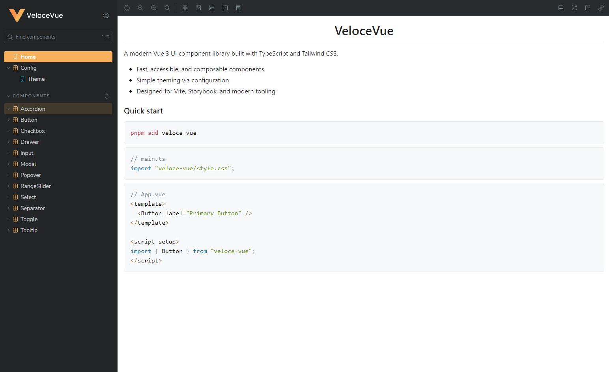

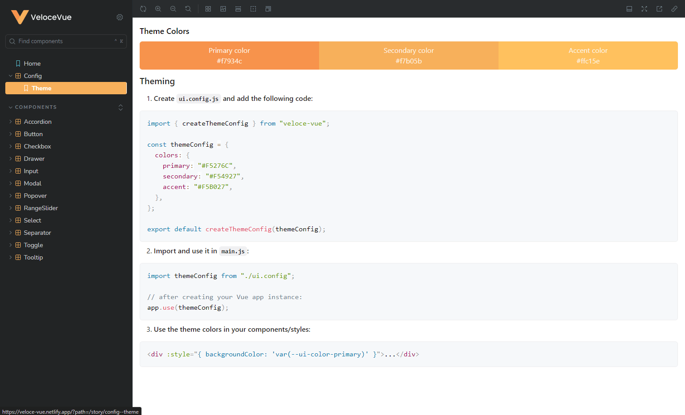

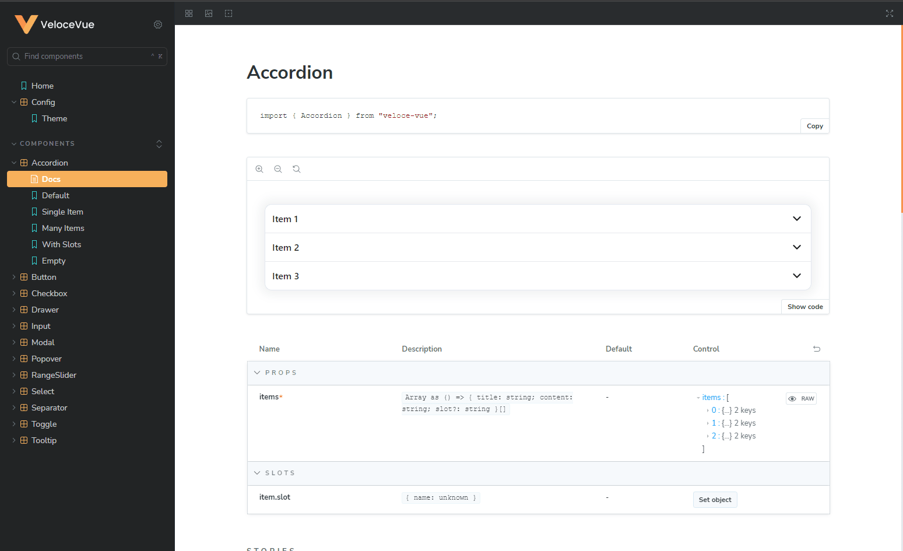

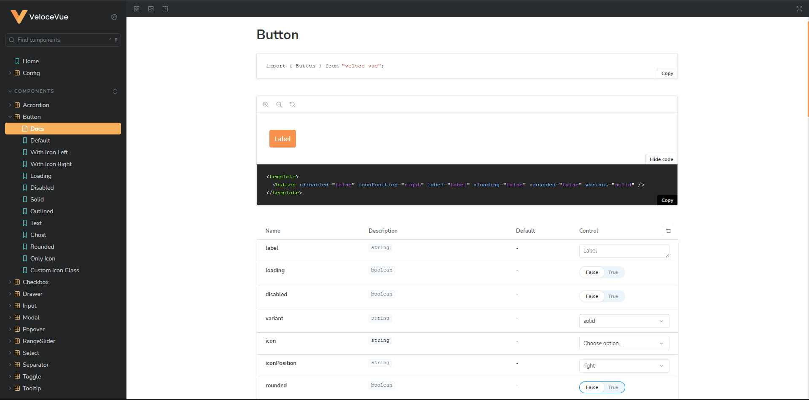

### Engraving Builder (Volumenzeit)

Interactive product customizer for Volumenzeit watch straps: upload images, add text, pre-made designs, patterns, and layers, then drag, resize, and rotate elements against a live preview before ordering.

- Stack: Vue 3 + Vite, PrimeVue, Tailwind CSS, Pinia, Firebase

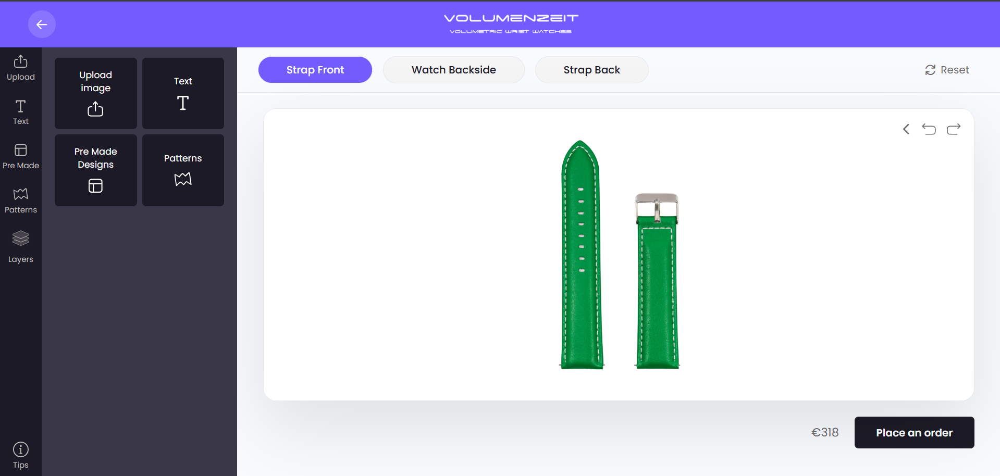

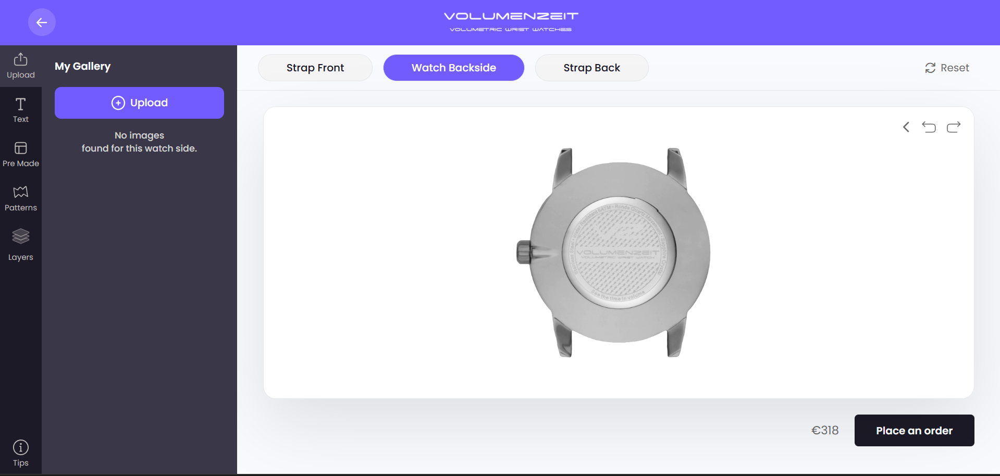

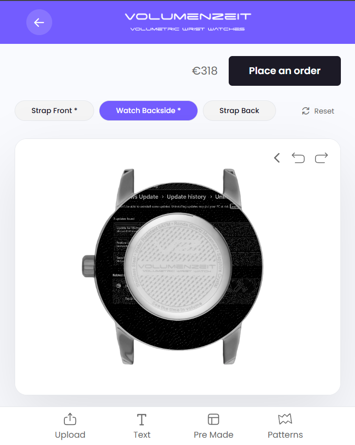

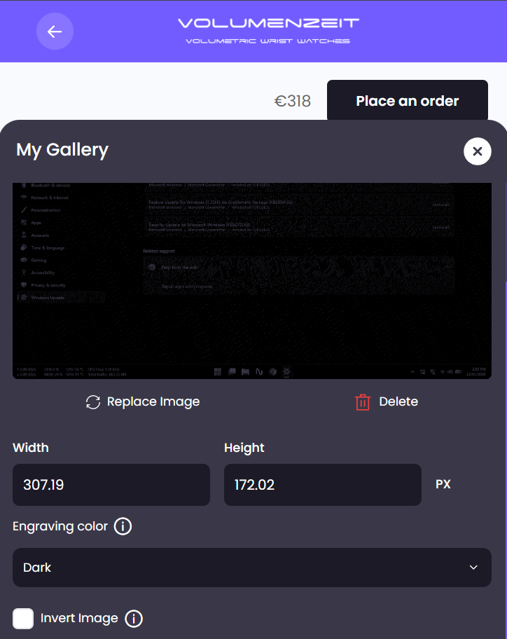

### GFPS Corporate Platform

Operations platform for the legal and insurance short-pay space: shops, attorneys, customers, and insurance companies, with status-driven short-pay workflows, demand letters, dashboards, data tables, and multi-step forms.

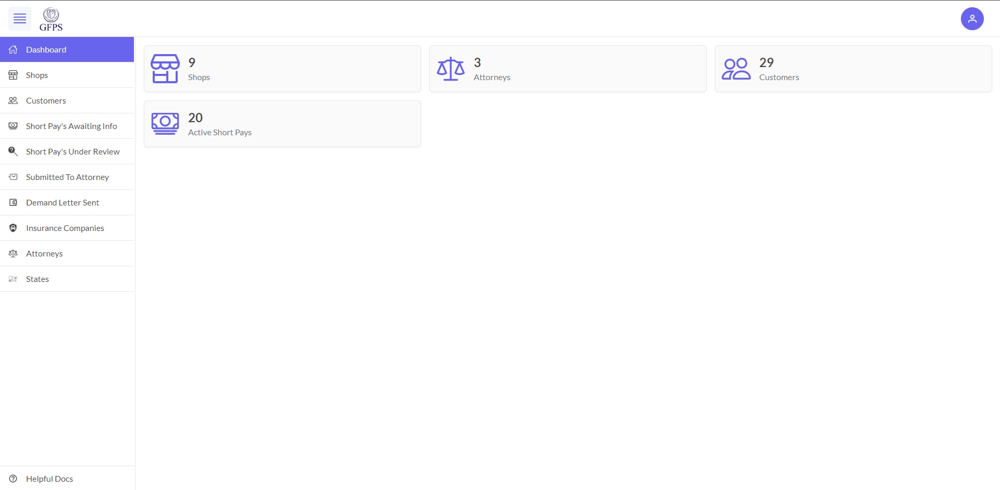

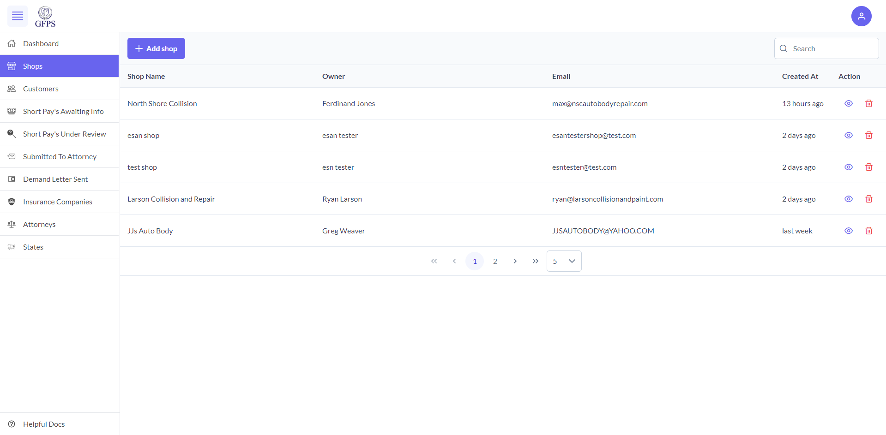

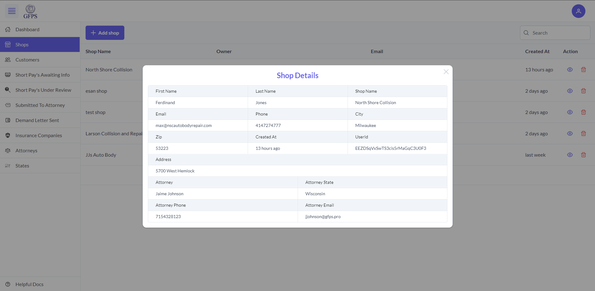

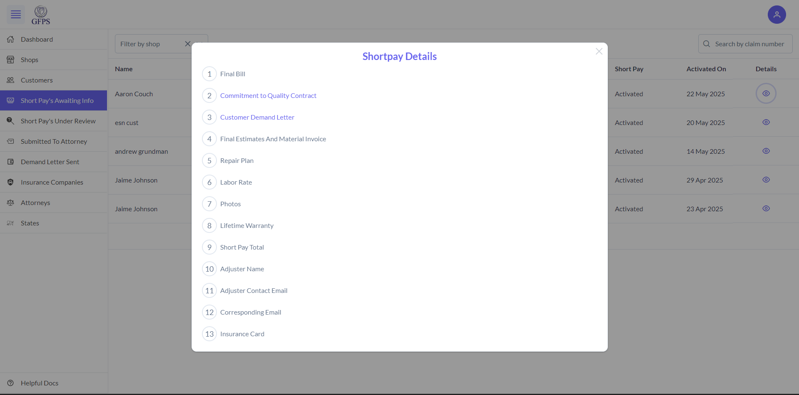

### Volumenzeit

Site built with Nuxt 3 and Nuxt UI.

- Live: https://volumenzeit-nuxt.vercel.app/

### Afterrecordings

Application built with Nuxt 3 and Nuxt UI.

- Live: https://afterrecordings.vercel.app/
